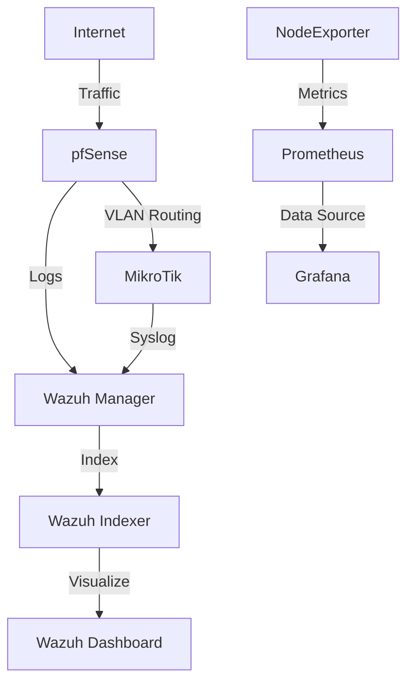

# CyberLab

One-command cybersecurity lab deployment. Installs Wazuh SIEM, Prometheus, Grafana, pfSense configurations, MikroTik router configs, endpoint hardening scripts, and network monitoring tools with a single command.

## Quick Install

```bash
curl -sL https://raw.githubusercontent.com/vtino17/cyberlab/main/installer.sh | bash
```

## One-Click Full Deployment

```bash
curl -sL https://raw.githubusercontent.com/vtino17/cyberlab/main/installer.sh | bash -s -- --all
```

## Component Selection

```bash
# Deploy individual components
curl -sL https://raw.githubusercontent.com/vtino17/cyberlab/main/installer.sh | bash -s -- --monitoring
curl -sL https://raw.githubusercontent.com/vtino17/cyberlab/main/installer.sh | bash -s -- --mikrotik
curl -sL https://raw.githubusercontent.com/vtino17/cyberlab/main/installer.sh | bash -s -- --pfsense
curl -sL https://raw.githubusercontent.com/vtino17/cyberlab/main/installer.sh | bash -s -- --endpoints
curl -sL https://raw.githubusercontent.com/vtino17/cyberlab/main/installer.sh | bash -s -- --wazuh
```

## What Gets Deployed

| Component | Description | Access |
|-----------|-------------|--------|
| Wazuh Manager | SIEM log collection and alerting | - |
| Wazuh Indexer | Log storage and indexing | https://localhost:9200 |
| Wazuh Dashboard | Security event visualization | https://localhost |
| Prometheus | Metrics collection and alerting | http://localhost:9090 |
| Grafana | Monitoring dashboards | http://localhost:3000 (admin/cyberlab) |
| MikroTik Configs | RouterOS VLAN, firewall, DNS scripts | Import via WinBox |
| pfSense Configs | Firewall and NAT rules | Import via WebGUI |
| Endpoint Scripts | Windows and Linux hardening | Run on target systems |

## Architecture



## Requirements

- Linux server or VM (Ubuntu 22.04+, Debian 12+, CentOS 9+)
- 8GB RAM minimum (16GB recommended)
- 50GB disk space
- Docker and Docker Compose

## Manual Deployment

```bash
git clone https://github.com/vtino17/cyberlab.git
cd cyberlab
bash installer.sh
```

## Access After Deployment

| Service | URL | Credentials |
|---------|-----|-------------|
| Wazuh Dashboard | https://localhost | admin/cyberlab |
| Grafana | http://localhost:3000 | admin/cyberlab |
| Prometheus | http://localhost:9090 | - |

## Tested On

- Ubuntu 24.04
- Debian 12
- macOS 14 (Sonoma)
- Raspberry Pi OS (arm64)

## License

MIT
